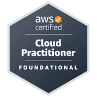
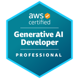
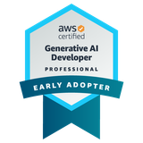

# Hi, I'm Zixuan Wu / 呉 梓軒

修士課程で研究を行いながら、業務システム開発・データ活用・クラウド実装を継続的に学んでいます。  
I’m a master’s student who enjoys building business systems, data-driven applications, and cloud-based solutions while continuously learning through hands-on projects.

  
  
  
  
  

**AWS Certified:** 
Cloud Practitioner；
Solutions Architect – Associate；
Generative AI Developer – Professional  
**Recognition:** Generative AI Developer – Professional Early Adopter
---

## About Me / 自己紹介

日本語  
私は、まず業務や利用者の流れを理解し、その上で設計・実装・検証を丁寧に積み上げることを大切にしています。  
特定の技術だけに固執するのではなく、目的に応じてツールやアーキテクチャを学び、試し、比較しながら改善していく姿勢を重視しています。  
まだ学ぶことは多いですが、好奇心を持って新しい技術に触れ、謙虚に手を動かしながら、実務に近い形で成果物を積み上げています。

English  
I value understanding business flow and user needs first, then building systems step by step through careful design, implementation, and validation.  
Rather than relying on one technology only, I try to choose tools and architectures based on purpose, learn them quickly, compare approaches, and improve iteratively.  
I still have a lot to learn, but I enjoy staying curious, working hands-on, and building practical portfolio projects with humility and discipline.

---

## Working Style / 開発姿勢

日本語  
すべての個人開発・作品づくりにおいて、以下の流れを意識しています。

**要件定義 → 基本設計 → 詳細設計 → 開発 → テスト（UT／IT／ST） → リリース → 運用保守**

単に「動くもの」を作るだけでなく、  
- 何を解決するのか  
- どのような設計判断をしたのか  
- どのように検証したのか  
- 今後どう改善できるのか  

まで含めて整理し、GitHub 上でも読み手に伝わる形にすることを心がけています。

English  
Across all of my projects, I try to follow the full lifecycle:

**Requirements Definition → High-Level Design → Detailed Design → Development → Testing (UT / IT / ST) → Release → Operation & Maintenance**

My goal is not only to make something that works, but also to make clear:
- what problem it solves,
- what design decisions were made,
- how it was validated,
- and how it can be improved further.

---

## Technical Interests / 技術的な関心

- Full-stack web development
- Backend/API design
- Business systems and internal tools
- AI-assisted workflow automation
- Cloud architecture on AWS
- Data analysis / BI / analytics workflows
- Test automation and validation

---

## Tech Stack / 技術スタック

### Application Development
- React
- TypeScript
- Vite
- Node.js
- Express
- FastAPI
- Prisma

### Database / Data
- MySQL
- PostgreSQL
- SQL
- Python
- BI / analytics-oriented data modeling

### Cloud / Infrastructure
- Docker
- Docker Compose
- AWS
  - ECS Fargate
  - ALB
  - RDS
  - CloudWatch
  - IAM
- Terraform

### Testing / Quality
- Jest
- Vitest
- Playwright
- Swagger / API documentation
- CI workflows

---

## Featured Projects / 代表プロジェクト

### 1. [ec-inventory-management-system]
**Small-scale EC Inventory Management System**  
React, Express, Prisma, MySQL, Docker, Swagger, Playwright を用いて構築したフルスタック作品です。  
ユーザー向け購買導線と、管理者向けの商品・在庫・注文管理を一体化し、認証・権限制御・在庫整合性・API 設計・自動検証までを一通り整理しました。

- React + TypeScript frontend
- Express + Prisma backend
- JWT authentication and role-based access control
- Transaction-based ordering and stock consistency
- Swagger API docs, Docker Compose, CI, Playwright smoke test

役割・貢献 / My Role and Contribution

個人開発として、要件整理、画面設計、API設計、DB設計、実装、テスト、README整理まで一貫して担当しました。AIツールは、初期設計案の比較、API仕様の叩き台作成、テストケースの初期草案、ドキュメント整理の高速化に活用しました。

As a solo project, I handled the full lifecycle end-to-end: requirements clarification, UI design, API design, database design, implementation, testing, and README documentation. I used AI tools mainly to speed up early design comparison, draft API specifications, propose initial test cases, and improve documentation efficiency.

プロセスと意図 / Process and Intent

最初に「在庫整合性」「権限制御」「管理画面と購買導線の分離」を主要論点として定義し、そこから設計を進めました。AIを活用して実装速度を高めつつも、在庫更新や注文処理はトランザクションを意識し、Swagger、Playwright、CIを使って検証可能な形を優先しました。意図は、短時間で形にしながらも、壊れにくい業務システムの最小単位を示すことでした。

I started by defining the core concerns: stock consistency, role-based access control, and clear separation between admin workflows and customer purchase flows. While AI helped accelerate implementation, I intentionally focused on transaction-aware order handling and verification through Swagger, Playwright, and CI. The goal was to demonstrate a minimum but reliable business system, not just a quick demo.

学び・改善点 / Learning and Improvements

学んだのは、AIを使うほど「作る速さ」と同時に「壊れ方を先に考える視点」が重要になることです。今後は、在庫競合のケースをさらに増やしたテスト、監査ログ、運用時の異常検知などを強化したいです。

My main learning was that the more AI accelerates implementation, the more important it becomes to think about failure modes and validation early. As next steps, I would strengthen concurrent inventory edge-case testing, audit logging, and operational monitoring for abnormal events.
---

### 2. [team-knowledge-copilot-v1]
**Internal Knowledge Assistant Prototype**  
FastAPI ベースの社内向けナレッジアシスタントです。  
ドキュメント取り込み、引用付き Q&A、AI 日報生成などを通じて、業務知識の検索性と共有効率を高めることを目指しました。

- FastAPI-based backend
- Document ingestion pipeline
- Citation-based Q&A
- AI-assisted daily report generation
- Knowledge workflow prototype for internal teams

役割・貢献 / My Role and Contribution

個人で、ユースケース設計、文書処理フロー設計、FastAPI実装、回答形式の整理、README作成を担当しました。AIツールは、プロンプト改善、要約表現の比較、日報生成の出力形式整理、想定質問の洗い出しに活用しました。

As a solo project, I designed the use case, document-processing flow, FastAPI implementation, answer formatting, and project documentation. I used AI tools for prompt iteration, comparison of summarization styles, formatting of daily report outputs, and generation of likely user questions.

プロセスと意図 / Process and Intent

最初に「検索できるだけでなく、引用付きで答えられること」を要件として置きました。AI時代の社内ナレッジ活用では、回答の速さだけでなく、根拠の見える化が重要だと考えたためです。そのため、単なる要約ではなく、参照元を示す構成を優先しました。短時間で試作しつつ、回答品質を観察し、改善しやすい構成にしました。

I defined the core requirement as not only “searchable,” but also “able to answer with citations.” In internal AI knowledge workflows, speed alone is not enough; traceability of evidence matters. For that reason, I prioritized source-grounded answers over pure summarization. The prototype was built quickly, but structured so that answer quality could be observed and iteratively improved.

学び・改善点 / Learning and Improvements

学んだのは、AIの回答品質はプロンプトだけでなく、入力文書の構造や検索設計にも大きく左右されることです。今後は、評価指標の明確化、回答精度の継続検証、ユーザーごとの権限制御まで発展させたいです。

I learned that AI answer quality depends not only on prompting, but also heavily on document structure and retrieval design. Going forward, I would improve explicit evaluation metrics, continuous answer quality checks, and user-level access control.
---

### 3. [Internal-Ops-Ticket-Hub]
**Internal Operations Ticket Platform on AWS**  
社内運用向けのチケット管理システムで、AWS 上での構成を意識して設計したプロジェクトです。  
アプリケーションの機能だけでなく、ALB・ECS Fargate・RDS・CloudWatch・IAM Role・Terraform による構成管理まで含めて、運用を見据えた形でまとめています。

- AWS ECS Fargate
- Application Load Balancer (ALB)
- RDS PostgreSQL
- CloudWatch logs and monitoring
- IAM role design
- Terraform-based infrastructure definition

---

### 4. [MetaERP]
**Salesforce-inspired ERP Product Prototype**  
Salesforce のような「オブジェクト駆動・メタデータ駆動」の考え方を意識した ERP プロトタイプです。  
単なる CRUD ではなく、業務オブジェクト、画面構成、承認ワークフロー、運用管理の観点を意識して設計しています。

- Object-driven design
- Metadata-driven UI concept
- Approval-based procurement workflow
- Enterprise-style admin product prototype

---

### 5. [Ecommerce-Sales-Inventory-Analytics-Portfolio]
**BI / Analytics Portfolio for Ecommerce Operations**  
EC の売上分析・在庫健全性・仕入先パフォーマンス・欠品リスク分析を題材にしたデータ分析作品です。  
SQL、Python、指標設計、レポーティングの観点を整理し、データから業務改善提案につなげることを意識しています。

- Ecommerce KPI analysis
- Sales and inventory health analytics
- Supplier performance analysis
- Stockout risk perspective
- BI / reporting-oriented portfolio work

---

## What I Try to Show Through My Projects / 作品を通して示したいこと

日本語  
私は、派手な技術を並べることよりも、  
**「課題を理解し、設計し、作り、検証し、改善する」** という一連のプロセスを大切にしています。

そのため、GitHub 上の各プロジェクトでも以下を意識しています。
- README や設計資料を残す
- 実装意図と構成を説明できるようにする
- テストや検証結果を残す
- 将来の改善点も書いておく

English  
More than simply collecting technologies, I try to demonstrate the full engineering process:
**understand the problem, design a solution, build it, validate it, and improve it.**

That is why my repositories usually include:
- README and design notes
- implementation rationale
- test/validation steps
- future improvements and limitations

---

## Current Focus / 現在注力していること

- 業務システム・社内ツール開発
- API / backend design
- AI を活用した実務支援機能
- AWS を用いた運用を意識した構成
- データ分析・BI 的な視点を含むアプリケーション設計
- 自動テストとブラウザ検証

---

## Languages / 言語

- Japanese / 日本語
- English / 英語
- Chinese / 中文

技術文書・README・設計メモを、日本語と英語の両方で整理することを意識しています。  
I try to keep technical documentation and project descriptions readable in both Japanese and English.

---

## Links / リンク

- GitHub: [@noki8188](https://github.com/noki8188)

---

## Note / 補足

AI活用に関する考え方 / How I Think About AI in Projects

私は、AIの価値は「ただ早く作ること」ではなく、短時間で仮説を形にし、すぐに検証し、必要に応じて改善を繰り返せることにあると考えています。AIを使うことで、要件整理、実装補助、ドキュメント作成、テスト作成、比較検討の初速を高められます。一方で、AIを使うほど検証の仕組みは重要になります。OpenAIは、実運用のAIアプリには「中核ロジック」に加えて、品質・安全性・信頼性を測るevalsが重要だとしています。Anthropicも、まず難しい課題を素早く反復し、その後テスト範囲を広げること、さらにビルド・テスト・lint による自己検証ループが有効だと述べています。GitHubも、AIコーディング支援は開発者の生産性向上や反復作業の削減に役立つと報告しています。私は、AIを「代わりに作るもの」ではなく、仮説生成と実装速度を高めつつ、人間が検証責任を持つための増幅器として使いたいと考えています。  

I see the value of AI not as “just building faster,” but as turning hypotheses into working artifacts quickly, validating them early, and improving them continuously. AI is useful for accelerating requirements exploration, implementation support, documentation, test drafting, and rapid comparison of options. At the same time, the more AI is used, the more important verification becomes. OpenAI emphasizes that production-ready AI applications need not only core logic, but also evaluations (evals) to measure quality, safety, and reliability. Anthropic similarly recommends iterating quickly on hard tasks first, then expanding test coverage, and creating self-verifying loops through builds, tests, and linting. GitHub has also reported productivity gains and reduced repetitive effort with AI coding assistance. My view is that AI should not replace engineering judgment; it should serve as an accelerator for hypothesis generation and implementation, while humans remain responsible for validation and quality.
